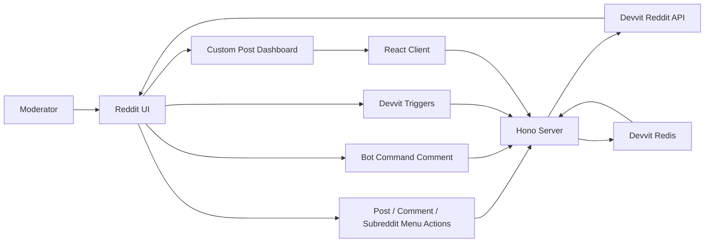
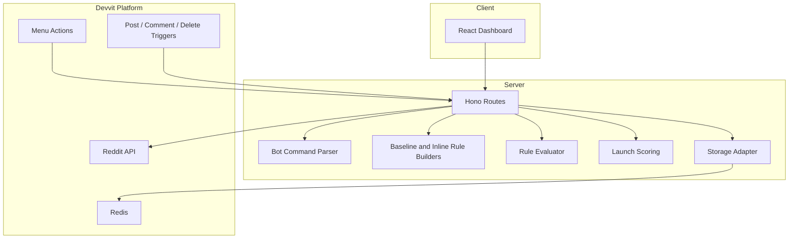
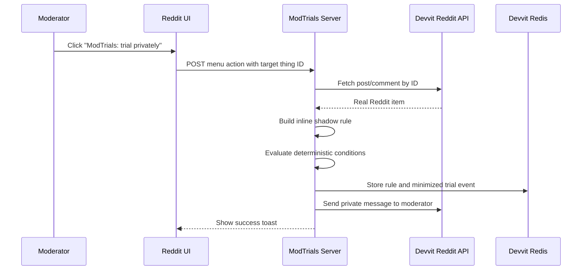
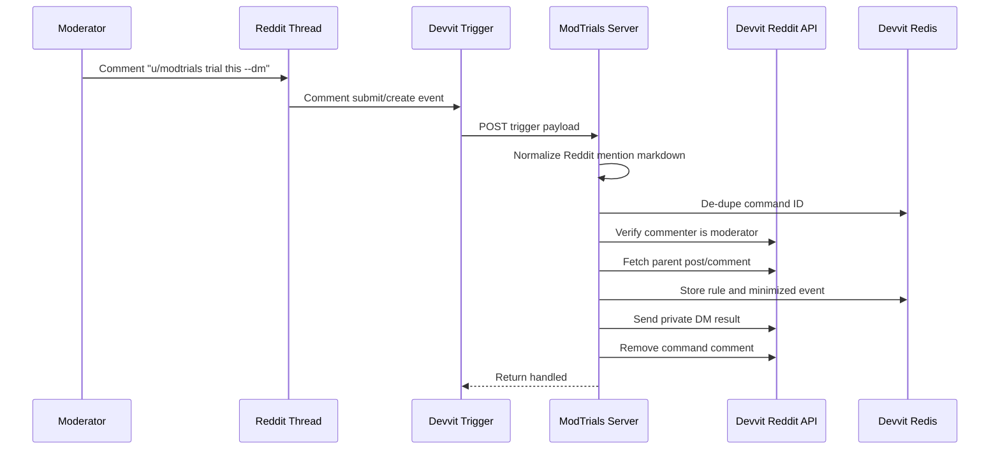
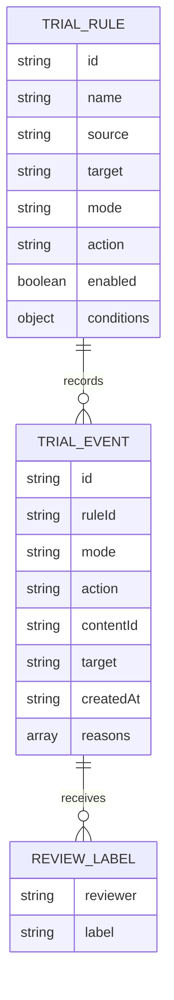
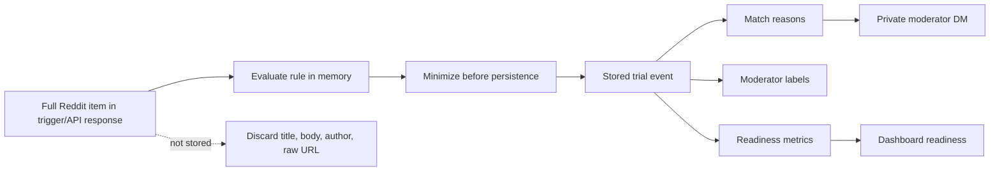
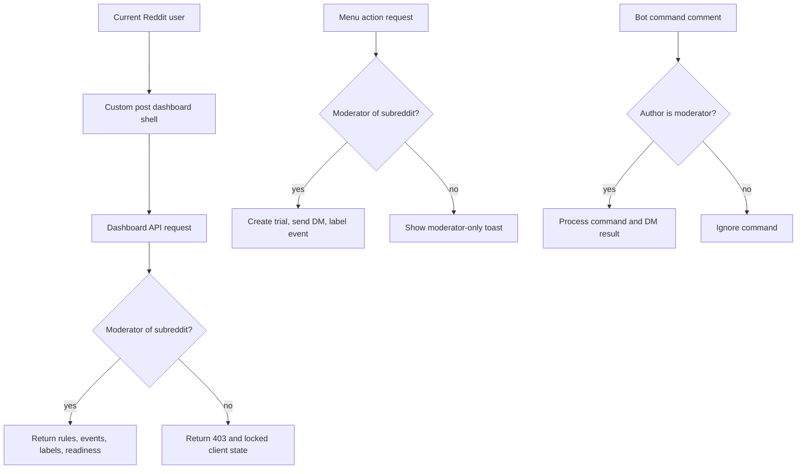
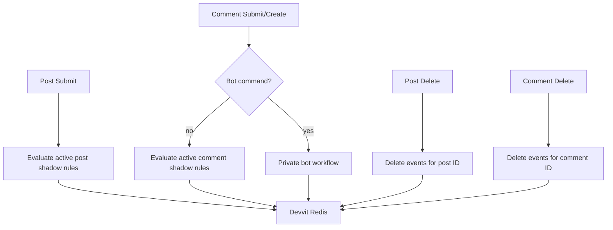
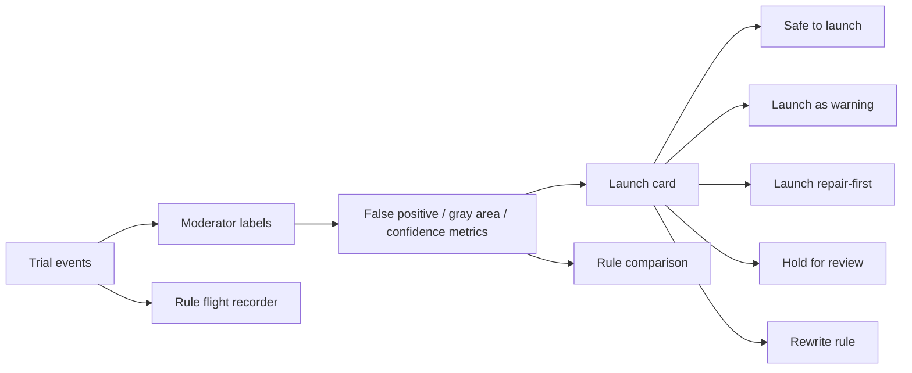
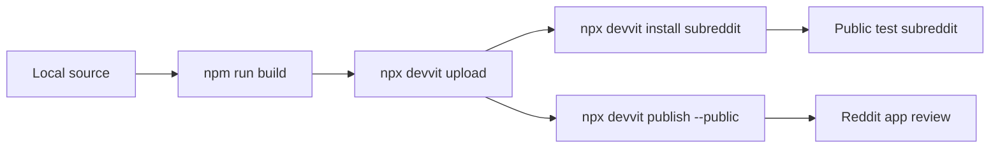

# ModTrials Architecture

ModTrials is a Devvit Web app with a React dashboard, a Hono server, Devvit Reddit APIs, and Devvit Redis. The primary product surface is native Reddit moderation actions and bot commands; the dashboard is a secondary audit view.

## System Overview

## Runtime Components

Key files:

- [src/server/index.ts](/home/divij/vincent/modtrials/src/server/index.ts): HTTP routes, menu actions, trigger handlers, bot command workflow.
- [src/server/bot-commands.ts](/home/divij/vincent/modtrials/src/server/bot-commands.ts): command parsing and private DM message builders.
- [src/server/trials.ts](/home/divij/vincent/modtrials/src/server/trials.ts): rule evaluation to trial event recording.
- [src/server/storage.ts](/home/divij/vincent/modtrials/src/server/storage.ts): Devvit Redis persistence and privacy minimization.
- [src/shared/evaluator.ts](/home/divij/vincent/modtrials/src/shared/evaluator.ts): deterministic rule matching.
- [src/shared/scoring.ts](/home/divij/vincent/modtrials/src/shared/scoring.ts): launch readiness metrics.
- [src/client/main.tsx](/home/divij/vincent/modtrials/src/client/main.tsx): dashboard UI.

## Private Trial Flow

## Bot Command Flow

The app listens to both `onCommentSubmit` and `onCommentCreate` because Reddit can emit both paths. Command IDs are stored in Redis so the same command does not send duplicate DMs.

## Evidence Model

Trial events intentionally store minimized content metadata. The full post/comment is fetched from Reddit only when needed for live evaluation.

## Privacy Boundary

Stored trial events do not keep usernames, full bodies, titles, or raw URLs. This keeps ModTrials focused on rule safety rather than user profiling.

## Permission Boundary

Menu items are also declared with `forUserType: "moderator"` in [devvit.json](/home/divij/vincent/modtrials/devvit.json). Server checks are still enforced for every menu action and dashboard API endpoint so the app fails closed even if a request is submitted directly.

## Trigger Coverage

## Launch Readiness

Readiness is advisory. ModTrials does not enforce rules automatically.

The flight recorder is derived from rule creation timestamps, first/latest matching events, labels, and the current launch card. It is a safety timeline, not a separate user profile. Rule comparison uses the same minimized trial events to compare active rules by readiness, false-positive risk, gray-area risk, confidence, and evidence volume.

## Deployment Flow

For hackathon testing, the app is installed in `r/ASIfacts`. For broader public use, `devvit publish --public` submits the app and source zip to Reddit's public review flow.
